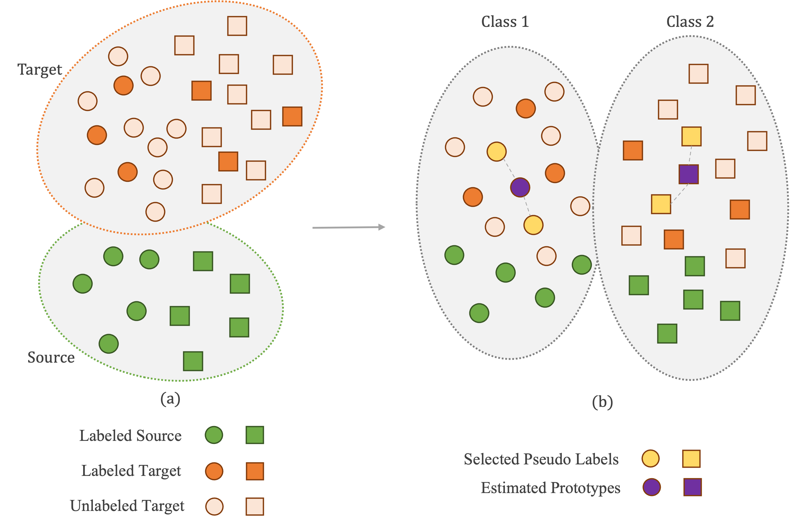

# AdaEmbed: Semi-supervised Domain Adaptation in the Embedding Space

[**AdaEmbed**](https://arxiv.org/abs/2401.12421) is a domain adaptation framework for both **unsupervised (UDA)** and **semi-supervised (SSDA)** settings on image classification tasks. It learns a shared embedding space between source and target domains, uses prototype-based pseudo-labeling to generate accurate and balanced labels for unlabeled target samples, and applies contrastive learning to align instance features across domains.



---

## Method

AdaEmbed consists of three training objectives:

1. **Supervised loss** (`Ls`) — cross-entropy on labeled source and target samples.
2. **Pseudo-label loss** (`Lt`) — cross-entropy on unlabeled target samples whose momentum features fall within the *k*-nearest neighbors of class prototypes. Sampling is balanced per prototype to produce a near-uniform pseudo-label distribution.
3. **Contrastive loss** (`Lc`) — InfoNCE loss that pushes apart target features with different pseudo-labels in the embedding space using a momentum memory bank.

A **gradient reversal layer** implements minimax entropy training: the classifier maximizes entropy over unlabeled target predictions (updating prototypes toward domain-invariant positions) while the encoder minimizes it.

**Backbone:** Swin Transformer V2 (tiny). Any standard classification backbone can be substituted — AdaEmbed is model-agnostic.

---

## Datasets

| Dataset | Domains | Classes |
|---|---|---|
| **DomainNet-126** | Real, Sketch, Clipart, Painting | 126 |
| **Office-Home** | Real, Clipart, Art, Product | 65 |
| **VisDA-C** | Synthetic → Real | 12 |

Download DomainNet and VisDA-C (downloads to `/data` by default):
```bash
bash download_data.sh
```

---

## Installation

```bash
pip install -e .
```

**Key dependencies:** PyTorch, torchvision ≥ 0.4.2, pytorchvideo, scikit-learn, einops, tensorboard, yacs, opencv-python.

---

## Running Experiments

All experiments are launched through `tools/run_net.py`. The `ADAPTATION.ADAPTATION_TYPE` field in the config selects the method.

```bash
python tools/run_net.py --cfg configs/domainnet/R2P_AdaEmbed_SwinV2T.yaml
```

Before running, update the following fields in the config to match your environment:

- `TRAIN.CHECKPOINT_FILE_PATH` — path to pretrained Swin Transformer V2 weights (ImageNet-1K)
- `DATA.PATH_TO_DATA_DIR` / `DATA.PATH_PREFIX` / `DATA.PATH_TO_PRELOAD_IMDB` — dataset root
- `OUTPUT_DIR` — logging and checkpoint output directory
- `TENSORBOARD.CLASS_NAMES_PATH` — path to the dataset `classnames.json` file
- `NUM_GPUS` — number of GPUs available (configs default to 8)

**SSDA mode** (e.g., 3-shot): set `ADAPTATION.SEMI_SUPERVISED.ENABLE: True` and `ADAPTATION.SEMI_SUPERVISED.NUM_SHOTS: 3` in the config.

### Key Hyperparameters

| Parameter | Value |
|---|---|
| Base LR | 0.05 (cosine, SGD) |
| Max epochs | 50 |
| Memory bank size (`M`) | 1000 |
| EMA momentum (`m`) | 0.95 |
| Neighbors (`k`) | 10 |
| Contrastive temperature | 0.05 |
| Pseudo-label threshold (`τ`) | 0.9 |
| `λ_t` | 2.0 |
| `λ_c` | 0.1 |
| `λ_p` (prototype loss) | 0.1 |
| `λ_H` | 0.1 |

---

## Implemented Baselines

The following methods are available under the same framework and config structure:

- **Supervised only** — labeled data only
- **MME** (Minimax Entropy) — `ADAPTATION_TYPE: MME`
- **CLDA** — contrastive learning for SSDA
- **ECACL** — categorical alignment with strong augmentation
- **AdaMatch** — `ADAPTATION_TYPE: AdaMatch`
- **AdaContrast** — test-time adaptation via nearest-neighbor pseudo-label refinement
- **AdaEmbed** — `ADAPTATION_TYPE: AdaEmbed` *(ours)*

Configs for each baseline are provided under `configs/domainnet/`, `configs/office_home/`, and `configs/visda/`.

---

## Results

AdaEmbed sets a new state of the art on all three benchmarks.

**DomainNet-126 Average Accuracy:**

| Setting | MME | AdaMatch | AdaContrast | **AdaEmbed** |
|---|---|---|---|---|
| UDA | 63.46 | 75.42 | 72.90 | **75.98** |
| 1-shot | 69.25 | 76.82 | 76.65 | **77.34** |
| 3-shot | 72.46 | 78.28 | 78.72 | **78.97** |

**VisDA-C Average Accuracy:**

| Setting | AdaContrast | **AdaEmbed** |
|---|---|---|
| UDA | 83.42 | **87.08** |
| 1-shot | 77.25 | **86.83** |
| 3-shot | 85.00 | **87.25** |

---

## Repository Structure

```
configs/
  domainnet/        # DomainNet-126 configs (all methods)
  office_home/      # Office-Home configs (all methods)
  visda/            # VisDA-C configs (all methods)
  ucf_hmdb/         # UCF → HMDB video configs
  kinetics/         # Kinetics video configs
  imagenet/         # ImageNet supervised baseline configs
tools/
  run_net.py        # Main entry point
  train_adaembed.py # AdaEmbed training loop
  train_adamatch.py # AdaMatch training loop
  train_mme.py      # MME training loop
  train_mcd.py      # MCD training loop
  mme.py            # MME launcher
  test_net.py       # Evaluation
  extract_features.py
  visualization.py
slowfast/
  models/           # Backbones (Swin V2, ViT, ResNet, I3D, ...)
  datasets/         # Data loaders
  utils/            # Logging, metrics, checkpointing
  config/           # Default config and schema
```

---

## License

This codebase is built on [PySlowFast](https://github.com/facebookresearch/slowfast), which is released under the [Apache 2.0 License](https://www.apache.org/licenses/LICENSE-2.0). The Swin Transformer V2 implementation is Copyright (c) 2022 Microsoft and released under the [MIT License](https://opensource.org/licenses/MIT).

---

## Citation

```bibtex
@article{mottaghi2024adaembed,
  title={AdaEmbed: Semi-supervised Domain Adaptation in the Embedding Space},
  author={Mottaghi, Ali and Jamal, Mohammad Abdullah and Yeung, Serena and Mohareri, Omid},
  year={2024},
  url={https://arxiv.org/abs/2401.12421}
}
```
